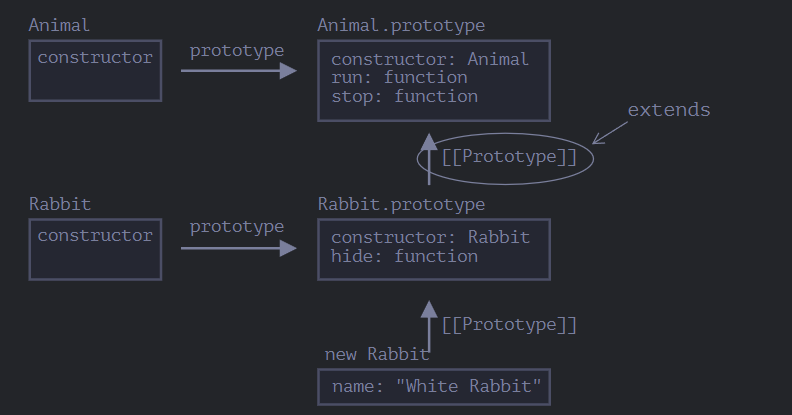

# Classes

## Class Syntax

We can create multiple objects of same type using the `new Keyword`

```JS
class MyClass {
  constructor(){
    // constructor function
  }

  method1 () {

  }

  method2 () {

  }
}
```

We can use `new MyClass()` to create objects of MyClass. The new keyword calls the `constructor()`

```JS
class Person {
  constructor(name) {
    this.name
  }

  sayHi () {
    console.log(`Hi ${this.name}`)
  }
}

const person = new Person("Hope")
person.sayHi()
```

### Class is a function

Class is a kind of a function in javascript

```js
class User {
  constructor(name) {
    this.name = name;
  }
  sayHi() {
    alert(this.name);
  }
}

// proof: User is a function
alert(typeof User); // function
```

What this does is,

- It creates a function called User and assigns the defintion inside constructor to it
- It stores the methods defined in the class, in its prototype

> The new keyword sets the prototype of the object to be same as the prototype of the class
>
> ```js
> const s = new Student();
> s.__proto__ === Student.prototype;
> ```

User class prototype will be User.prototype
new keyword sets the `__proto__` of all the new objects that are created using the class definition to be of User.prototype

### Differences between functions declared using Class syntax and functional impleimientaton

It is not just syntactic sugar. It is much more than that.

1. Functions created using class syntax have a special hidden property `[[IsClassConstructor]]:true`. The language ensures that these functions are called with `new` keyword only.
2. Class methods are non-enumerable i.e., they don't show in for....in and Object.keys(). Becuase it sets enumerable flag to false.
3. Code inside a class is always in `strict` mode

```js
let user = class {
  constructor() {}
};

/*
  This is a valid class
  - can be named expressions
  - can be returned as value of function
*/
```

They have getters and setters

```js
class Person() {
  constructor(name) {
    this.name = name
  }

  get name() {
    return this._name
  }

  set name(value) {
    this._name = value
  }
}
```

We can add properties to the classes. They are called as **classfields**. These properties set on individual objects

```js
class Person {
  name = "John";
}
```

### Bound methods

```js
class Button {
  constructor(value) {
    this.value = value;
  }

  click() {
    alert(this.value);
  }
}

let button = new Button("hello");

setTimeout(button.click, 1000); // undefined
```

3 solutions

1. setTimeout wrapper
2. Bind method
3. make use of classfields

```js
class Button {
  constructor(value) {
    this.value = value;
  }
  click = () => {
    alert(this.value);
  };
}
```

## Class Inheritance

We can create new functionality on top of existing functionality.

### `extends`

```js
class Animal {
  constructor(name) {
    this.speed = 0;
    this.name = name;
  }

  run(speed) {
    this.speed = speed;
    console.log(`${this.name} runs with speed ${this.speed}.`);
  }
}
```

Lets add a rabbit class

```js
class Rabbit extends Animal {
  hides() {
    console.log(this.name + " hides");
  }
}
```

What this does is as below

- objects of Rabbit class haave access to both hides() and run() methods
- It makes use of the prototypal chain and sets the `Rabbit.prototype.[[prototype]]` to `Animal.prototype`. This is done when we use extends keyword
  

### Overrriding

By default all the methods in parent are inherited as is. If the child class wants to override one of the methods, it can do so.

If you are extending on top of existing defintition of method make use of `super.method()`. use `super()` for constructor.

> NOTE: While override constructors, super() should be called before accessing `this`.

This needs to be done because when a regular function is executed with new keyword, it creates an object and assigns it to this. But in the case of derived constructor (constructor of the child class,it expects the parent to do it)

## Static properties or methods

properties and methods can be defined for the entire class. they are called static properties and methods

```js
class User {
  static staticMethod() {}
}

/* Add static keyword */
```

This is same as assigning property directly

```js
User.staticMethod = function () {};
```

The value of `this` in static methods is the class iteself. They are not available on individual objects. Recent Addition

### Inheritance of static properties

They are inherited in the derived class.

The “extends” syntax sets up two prototypes:

Between "prototype" of the constructor functions (for methods).
Between the constructor functions themselves (for static methods).

## Private and protected methods and properties

In object-oriented programming, properties and methods are split into two groups:

- Internal interface – methods and properties, accessible from other methods of the class, but not from the outside. - **Private fields**
- External interface – methods and properties, accessible also from outside the class. - **Public fields**
- Fields that are accessible from inside and the class and other classes that extend it are callled as **Protiected fields**. _Not implemented in JS_. But are emulated

### Protected

> Protected properties are usually prefixed with an underscore \_.

```js
class Students {
  _numberOfStudents = 0;

  set numberOfStudents(count) {
    if (count < 0) {
      count = 0;
    }
    this._numberOfStudents = count;
  }

  get numberOfStudents() {
    return this._numberOfStudents;
  }
}

const s = new Students();

s._numberOfStudents = -10; // this modifies the value
s.numberOfStudents = -10; // this does not

// don't use _ prefixed variables outside
```

### Readonly

Define only getter

### Private

Privates should start with #. They are only accessible from inside the class.

Can be used for both variables and functions

> Note:
> Built in classes don't inherit static methods from each other
